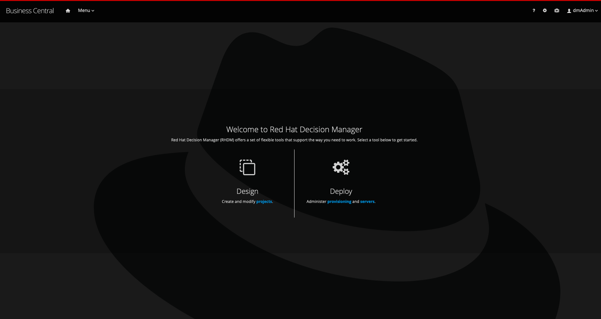
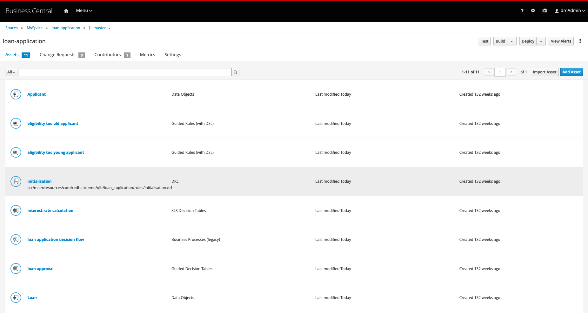
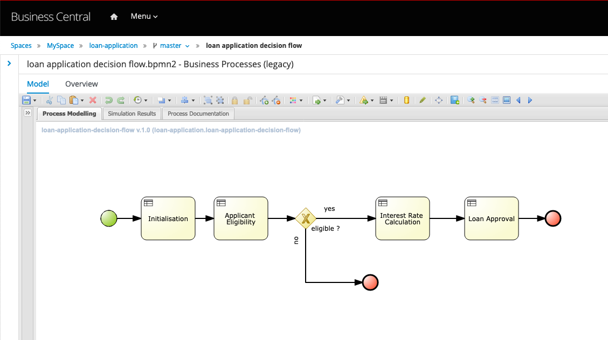
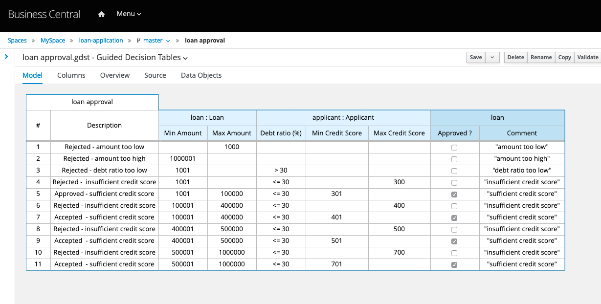
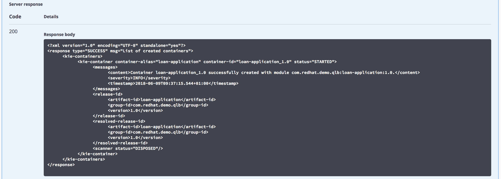

Red Hat Decision Manager Quick Loan Bank Demo
=============================================
This demo project showcases the tooling available in Red Hat Decision Manager implementing 
complex decision logic which can be exposed as a decision service. The Quick Loan Bank in this 
demo uses technical rules, decision tables, guided rules with a Domain Specific Language, and 
Excel decision tables to define its loan calculation and approval system.

You will be given examples of calling the rules as if using them from an application through 
the RestAPI that is exposed by the server. Furthermore, this demo provides a Node.js client 
application written in AngularJS and PatternFly that showcases how web applications can 
consume decision services deployed on the decision server.

You can install this project on your own machine or on an OpenShift Container Platform.


Installing on local machine
---------------------------
1. [Download and unzip.](https://github.com/jbossdemocentral/rhdm7-qlb-loan-demo/archive/master.zip).

2. Add products to installs directory, see installs/README for details and links.

3. Run 'init.sh' or 'init.bat' file. 'init.bat' must be run with Administrative privileges

Follow install output instructions and log in to http://localhost:8080/decision-central  (u:dmAdmin / p:redhatdm1!)

Kie Servier access configured (u: kieserver / p:kieserver1!)

Enjoy installed and configured Red Hat Decision Manager Quick Loan Bank Demo (see below for how to run demo).


Running the demo
----------------
1. Click on the "loan-application" project to open the Loan Application Demo project.

2. The project has simple data model (Loan & Applicant) and single decision table (loan-application) which contains the loan approval rule set.

3. Build and deploy version 1.0 of the project. Click on the "Build and Deploy" in the upper right corner.

4. Go to "Menu -> Deploy -> Execution Servers" repository to see the loan-application_1.0 KIE Container deployed on the Decision Server.

5. The decision server provides a Swagger UI that documents the full RESTful interface exposed by the server at: http://localhost:8080/kie-server/docs

6. In the Swagger UI:
   - navigate to "KIE Server and KIE containers"
   - expand the "GET" operation for resource "/server/containers"
   - click on "Try it out"
   - leave the parameters blank and click on "Execute"
   - when asked for credentials use: Username: kieserver, Password: kieserver1!
   - observe the response, which lists the KIE Containers deployed on the server and their status (STARTED, STOPPED).

7. We can use the Swagger UI to test our Loan Approval Decision Service. In the Swagger UI:
   - navigate to "KIE session assets"
   - expand the "POST" operation for resource "/server/containers/instances/{id}"
   - click on "Try it out"
   - set the "id" parameter to the name of the KIE Container that hosts our rules, in this case `loan-application_1.0`.
   - set "Parameter content type" to `application/json`.
   - set "Response content type" to `application/json`
   - use the following request as the "body" parameter. Note that the `Loan` object has its `approved` attribute set to `false`:
   ```
   {
      "lookup": "default-stateless-ksession",
      "commands": [
         {
            "insert": {
               "object": {
                  "com.redhat.demo.qlb.loan_application.model.Applicant": {
                     "creditScore":410,
                     "name":"Lucien Bramard",
                     "age":40,
                     "yearlyIncome":90000
                  }
               },
               "out-identifier":"applicant"
            }
         },
         {
            "insert": {
               "object": {
                  "com.redhat.demo.qlb.loan_application.model.Loan": {
                     "amount":250000,
                     "duration":10
                  }
               },
               "out-identifier":"loan"
            }
         },
         {
            "start-process" : {
               "processId" : "loan-application.loan-application-decision-flow",
               "parameter" : [ ],
               "out-identifier" : null
            }
         }
      ]
   }
   ```
   - observe the result. The Quick Loan Bank rules have fired and determined that, based on the credit score of the application, and the amount of the loan, the loan can be approved. The `approved` attribute of the `Loan` has been set to `true`.


Running demo with frontend application
--------------------------------------
1. Navigate to the *support/application-ui/* directory. The installation should have built the UI, but if not, manually 
run the command `npm install` to install the required modules. Start the client application by running `npm start`. This 
will start the NodeJS HTTP server and open the Quick Loan Bank client application in your browser (http://localhost:3000). 
Try to submit a new loan request using the same data as shown the JSON file at above. Try to enter different values to 
see a loan get disapproved, for example, change above applicant age from 40 to 80 for rejectoin based on age.

2. You can change the various rules as desired, change the version of the project, and redeploy a new version to a new 
KIE Container (allowing you to serve multiple versions of the same rule set at the same time on the same decision server). 
You can also build a new version of the project and use the Version Configuration tab of the container definition (in the 
Execution Servers screen) to manage the container using the UPGRADE button to pull the new version.


Installng on OpenShift Container Platform
-----------------------------------------
This demo can be installed on Red Hat OpenShift Container Platform in various ways. We'll explain the different options provided.

All installation options require an `oc` client installation that is connected to a running OpenShift instance. More information on OpenShift and how to setup a local OpenShift development environment based on the Red Hat Container Development Kit can be found [here](https://developers.redhat.com/products/cdk/overview/).

---
**NOTE**

The Red Hat Decision Manager 7 - Decision Central image requires a [Persistent Volume](https://docs.openshift.com/container-platform/3.7/architecture/additional_concepts/storage.html) which has both `ReadWriteOnce` (RWO) *and* `ReadWriteMany` (RWX) Access Types. If no PVs matching this description are available, deployment of that image will fail until a PV of that type is available.

---

### Automated installation, manual project import
This installation option will install the Decision Manager 7 and Decision Service in OpenShift using a single script, after which the demo project needs to be manually imported.

1. [Download and unzip.](https://github.com/jbossdemocentral/rhdm7-qlb-loan-demo/archive/master.zip) or [clone this repo](https://github.com/jbossdemocentral/rhdm7-qlb-loan-demo.git).

2. Run the "init-openshift.sh" (for Linux and macOS) or "init-openshift.ps1" (Windows) file. This will create a new project and application in OpenShift.

3. Login to your OpenShift console. For a local OpenShift installation this is usually: https://{host}:8443/console

4. Open the project "RHDM7 Quick Loan Bank Demo". Open the "Overview". Wait until the 2 pods, "rhdm7-loan-rhdmcentr" and "rhdm7-loan-kieserver" have been deployed.

5. Open the "Applications -> Routes" screen. Click on the "Hostname" value next to "rhdm7-loan-rhdmcentr". This opens the Decision Central console.

6. Login to Decision Central:

    ```
    - login for admin and analyst roles (u:dmAdmin / p:redhatdm1!)
    ```
7. Click on "Design" to open the design perspective.

8. Click on "Import project". Enter the following as the repository URL: https://github.com/jbossdemocentral/rhdm7-qlb-loan-demo-repo.git , and click on "Import".

9. Select "loan-application" and click on the "Ok" button on the right-hand side of the screen.

10. The project has simple data model (Loan & Applicant) and single decision table (loan-application) which contains the loan approval rule set.

11. Build and deploy version 1.0 of the project. Click on the "Build and Deploy" in the upper right corner.

12. Go to "Menu -> Deploy -> Execution Servers" repository to see the loan-application_1.0 KIE Container deployed on the Decision Server.

13. The Decision Server provides a Swagger UI that documents the full RESTful interface exposed by the server at. To open the Swagger UI, go back to
the OpenShift console, and go to the "Applications - Routes" screen. Copy the "Hostname" value next to "rhdm7-loan-kieserver". Paste the URL in a browser tab
and add "/docs" to the URL. This will show the Swagger UI.

14. Follow instructions 11 and 12 from above "Option 1- Install on your machine".

15. The AngularJS client application can also be accessed via an OpenShift route. Go back to the OpenShift console, and go to the "Applications - Routes" screen.
Click on the hostname of the "qlb-client-application", this will direct you to the client application. Try to submit a new loan request using the same data as shown the JSON file at step 12 of "Option 1 - Install on your machine". Try to enter different values to see a loan get disapproved.

16. You can change the various rules as desired, change the version of the project, and redeploy a new version to a new KIE Container (allowing you to serve multiple versions of the same rule set at the same time on the same Decision Server). You can also build a new version of the project and use the Version Configuration tab of the container definition (in the Execution Servers screen) to manage the container using the UPGRADE button to pull the new version.

### Scripted installation
This installation option will install the Decision Manager 7 and Decision Service in OpenShift using a the provided `provision.sh` script, which gives
the user a bit more control how to provision to OpenShift.

1. [Download and unzip.](https://github.com/jbossdemocentral/rhdm7-qlb-loan-demo/archive/master.zip) or [clone this repo](https://github.com/jbossdemocentral/rhdm7-qlb-loan-demo.git).

2. In the demo directory, go to `./support/openshift`. In that directory you will find a `provision.sh` script. (Windows support will be introduced at a later time).

3. Run `./provision.sh -h` to inspect the installation options.

4. To provision the demo, with the OpenShift ImageStreams in the project's namespace, run `./provision.sh setup rhdm7-loan --with-imagestreams`.

    ---
    **NOTE**

    The `--with-imagestreams` parameter installs the Decision Manager 7 image streams and templates into the project namespace instead of the `openshift` namespace (for which you need admin rights). If you already have the required image-streams and templates installed in your OpenShift environment in the `openshift` namespace, you can omit the `--with-imagestreams` from the setup command.

    ---

5. A second useful option is the `--pv-capacity` option, which allows you to set the capacity of the _Persistent Volume_ used by the Decision Central component. This is for example required when installing this demo in OpenShift Online, as the _Persistent Volume Claim_ needs to be set to `1Gi` instead of the default `512Mi`. So, to install this demo in OpenShift Online, you can use the following command: `./provision.sh setup rhdm7-loan --pv-capacity 1Gi --with-imagestreams`

6. To delete an already provisioned demo, run `./provision.sh delete rhdm7-loan`.

7. After provisioning, follow the instructions from above "Option 2 - Automated installation, manual project import", starting at step 3.

A full walkthrough of this demo on an OpenShift environment is provided [here](docs/walkthrough/qlb-demo-walkthrough.adoc).


Supporting articles
-------------------

- [Getting Started with Red Hat Decision Manager 7](https://developers.redhat.com/blog/2018/03/19/red-hat-decision-manager-7/)


Released versions
-----------------
See the tagged releases for the following versions of the product:

- v1.4 - Red Hat Decision Manager 7.8.0.GA

- v1.3 - Red Hat Decision Manager 7.7.0.GA

- v1.2 - Red Hat Decision Manager 7.5.0.GA

- v1.1 - Red Hat Decision Manager 7.1.0.GA

- v1.0 - Red Hat Decision Manager 7.0.0.GA














